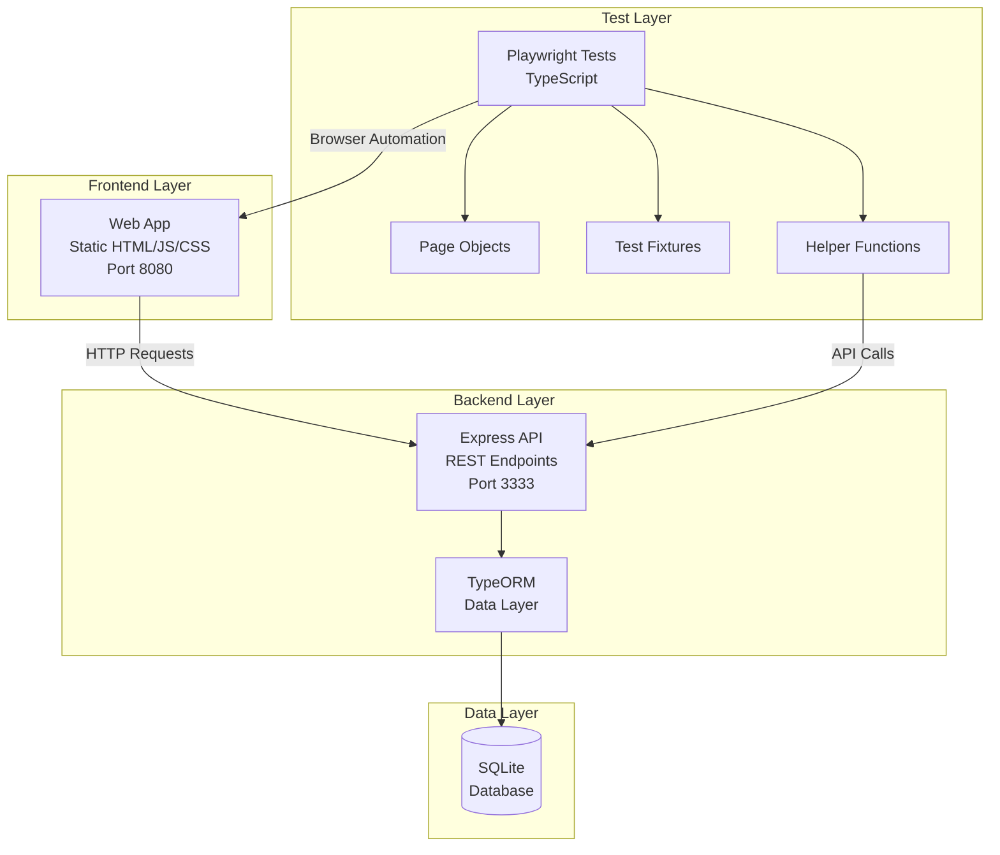

<div align="center">

# 🎭 Playwright Mark

### Professional End-to-End Testing Suite for Task Management

[](https://playwright.dev/)
[](https://www.typescriptlang.org/)
[](https://nodejs.org/)
[](https://expressjs.com/)
[](https://typeorm.io/)
[](https://www.sqlite.org/)

*A comprehensive monorepo featuring a full-stack task management application with enterprise-grade E2E test automation*

[Features](#-features) • [Architecture](#-architecture) • [Getting Started](#-getting-started) • [Documentation](#-documentation) • [Contributing](#-contributing)

</div>

---

## 📋 Table of Contents

- [About](#-about-the-project)
- [Features](#-features)
- [Architecture](#-architecture)
- [Technology Stack](#-technology-stack)
- [Getting Started](#-getting-started)
- [Project Structure](#-project-structure)
- [Testing Guide](#-testing-guide)
- [API Documentation](#-api-documentation)
- [Contributing](#-contributing)
- [Acknowledgments](#-acknowledgments)
- [License](#-license)

---

## 🎯 About the Project

**Playwright Mark** is a production-ready monorepo that demonstrates best practices in modern web development and test automation. The project consists of three main components:

1. **REST API** - Node.js/Express backend with TypeORM and SQLite
2. **Web Application** - Static frontend for task management
3. **E2E Test Suite** - Playwright-based automated testing with Page Object Model

This project serves as both a functional task management system and a reference implementation for professional test automation practices.

---

## ✨ Features

### 🚀 Application Features
- ✅ **Task Management** - Create, read, update, and delete tasks
- 🔄 **Real-time Updates** - Toggle task completion status
- 🎨 **Modern UI** - Clean and responsive interface
- 🔒 **Data Persistence** - SQLite database with TypeORM
- 🛡️ **Input Validation** - Yup schema validation
- 🌐 **CORS Support** - Cross-origin resource sharing enabled

### 🧪 Testing Features
- 🎭 **Cross-Browser Testing** - Chromium, Firefox, and WebKit support
- 📄 **Page Object Model** - Maintainable and scalable test architecture
- 🔧 **Test Fixtures** - Reusable test data and models
- 🔄 **Parallel Execution** - Fast test runs with parallel execution
- 📊 **HTML Reports** - Detailed test execution reports
- 🎬 **Trace Viewer** - Debug failed tests with trace recordings
- 🧰 **Helper Functions** - API utilities for test data management

---

## 🏗️ Architecture



### Design Patterns

- **Page Object Model (POM)** - Encapsulates page interactions for maintainability
- **Repository Pattern** - TypeORM repositories for data access
- **Fixture Pattern** - Centralized test data management
- **Helper Pattern** - Reusable test utilities and API interactions

---

## 🛠️ Technology Stack

### Testing & Automation


- **[Playwright](https://playwright.dev/)** - Modern end-to-end testing framework
- **[TypeScript](https://www.typescriptlang.org/)** - Type-safe test development
- **[@playwright/test](https://playwright.dev/docs/api/class-test)** - Test runner with assertions
- **[dotenv](https://github.com/motdotla/dotenv)** - Environment variable management

### Backend


- **[Express](https://expressjs.com/)** - Fast, unopinionated web framework
- **[TypeORM](https://typeorm.io/)** - ORM for TypeScript and JavaScript
- **[Better SQLite3](https://github.com/WiseLibs/better-sqlite3)** - Fast SQLite3 driver
- **[Yup](https://github.com/jquense/yup)** - Schema validation
- **[CORS](https://github.com/expressjs/cors)** - Cross-origin resource sharing
- **[UUID](https://github.com/uuidjs/uuid)** - Unique identifier generation

### Frontend


- **[http-server](https://github.com/http-party/http-server)** - Simple static file server
- **HTML/CSS/JavaScript** - Core web technologies

### Package Management


- **[Yarn](https://yarnpkg.com/)** - Fast, reliable dependency management

---

## 🚀 Getting Started

### Prerequisites

Ensure you have the following installed:

- **Node.js** (v18 or higher) - [Download](https://nodejs.org/)
- **Yarn** (v1.22 or higher) - [Installation Guide](https://yarnpkg.com/getting-started/install)

### Installation

1. **Clone the repository**
   ```bash
   git clone https://github.com/rafaeltmanso/playwright-mark.git
   cd playwright-mark
   ```

2. **Install dependencies**
   ```bash
   # Install root dependencies
   yarn install

   # Install API dependencies
   cd apps/api
   yarn install

   # Install Web dependencies
   cd ../web
   yarn install

   # Return to root
   cd ../..
   ```

3. **Install Playwright browsers**
   ```bash
   npx playwright install
   ```

4. **Configure environment variables**
   
   Create a `.env` file in the project root:
   ```env
   BASE_URL=http://localhost:8080
   BASE_API=http://localhost:3333
   ```

5. **Initialize the database**
   ```bash
   cd apps/api
   yarn db:init
   ```

### Running the Application

#### Start the API Server
```bash
cd apps/api
yarn dev
```
The API will be available at `http://localhost:3333`

#### Start the Web Application
```bash
cd apps/web
yarn start
```
The web app will be available at `http://localhost:8080`

---

## 📁 Project Structure

```
playwright-mark/
│
├── 📁 apps/                          # Application source code
│   ├── 📁 api/                       # Backend REST API
│   │   ├── 📁 src/
│   │   │   ├── app.js                # Express app configuration
│   │   │   ├── server.js             # Server entry point
│   │   │   ├── routes.js             # API route definitions
│   │   │   ├── data-source.js        # TypeORM data source config
│   │   │   ├── 📁 controllers/       # Request handlers
│   │   │   │   └── TaskController.js
│   │   │   ├── 📁 models/            # TypeORM entities
│   │   │   │   └── Task.js
│   │   │   ├── 📁 database/
│   │   │   │   ├── index.js          # Database initialization
│   │   │   │   └── 📁 migrations/    # Database migrations
│   │   │   ├── 📁 errors/            # Custom error classes
│   │   │   │   └── AppError.js
│   │   │   └── 📁 __tests__/         # Unit tests
│   │   │       └── Task.test.js
│   │   ├── package.json
│   │   └── ormconfig.json
│   │
│   └── 📁 web/                       # Frontend application
│       ├── index.html                # Main HTML file
│       ├── 📁 assets/                # Compiled assets
│       │   ├── index.*.css
│       │   └── index.*.js
│       └── package.json
│
├── 📁 tests/                         # E2E test suite
│   ├── home.spec.ts                  # Home page tests
│   ├── tasks.spec.ts                 # Task management tests
│   ├── 📁 fixtures/                  # Test data
│   │   ├── taskModel.ts              # Task type definitions
│   │   └── tasks.json                # Test data scenarios
│   ├── 📁 support/                   # Test utilities
│   │   ├── helpers.ts                # API helper functions
│   │   └── 📁 pages/                 # Page Object Models
│   │       └── 📁 tasks/
│   │           └── index.ts          # TasksPage class
│   └── 📁 types/                     # TypeScript type definitions
│       └── json.d.ts
│
├── 📁 playwright-report/             # Test execution reports
├── 📁 test-results/                  # Test artifacts and traces
├── playwright.config.ts              # Playwright configuration
├── package.json                      # Root dependencies
├── .env                              # Environment variables
└── README.md                         # Project documentation
```

---

## 🧪 Testing Guide

### Running Tests

#### Run all tests
```bash
yarn playwright test
```

#### Run tests in headed mode
```bash
yarn playwright test --headed
```

#### Run specific test file
```bash
yarn playwright test tests/tasks.spec.ts
```

#### Run tests in specific browser
```bash
yarn playwright test --project=chromium
yarn playwright test --project=firefox
yarn playwright test --project=webkit
```

#### Run tests in debug mode
```bash
yarn playwright test --debug
```

#### Run tests with UI mode
```bash
yarn playwright test --ui
```

### Viewing Test Reports

After test execution, view the HTML report:
```bash
npx playwright show-report
```

### Test Organization

#### Test Fixtures (`tests/fixtures/`)
Centralized test data management:
```typescript
// tasks.json
{
  "Success": {
    "name": "Read a book",
    "is_done": false
  },
  "Duplicate": {
    "name": "Duplicate task",
    "is_done": false
  }
}
```

#### Page Objects (`tests/support/pages/`)
Encapsulated page interactions:
```typescript
class TasksPage {
  async create(task: TaskModel)
  async toggle(taskName: string)
  async remove(taskName: string)
  async shouldHaveText(taskName: string)
}
```

#### Helper Functions (`tests/support/helpers.ts`)
API utilities for test setup:
```typescript
async function postTask(request, task)
async function deleteTaskByHelper(request, taskName)
async function deleteAllTasks(request)
```

### Test Scenarios Covered

✅ **Task Creation**
- Successfully create new tasks
- Validation for required fields
- Duplicate task detection

✅ **Task Updates**
- Toggle task completion status
- Status persistence validation

✅ **Task Deletion**
- Remove tasks from list
- Verify task no longer exists

✅ **Application Health**
- Verify web app is online
- Page title validation

---

## 📚 API Documentation

### Base URL
```
http://localhost:3333
```

### Endpoints

#### Tasks

| Method | Endpoint | Description | Request Body | Response |
|--------|----------|-------------|--------------|----------|
| `GET` | `/tasks` | List all tasks | - | `Task[]` |
| `POST` | `/tasks` | Create a new task | `{ name: string }` | `Task` |
| `PUT` | `/tasks/:id/done` | Mark task as done | - | `Task` |
| `DELETE` | `/tasks/:id` | Delete a task | - | `204` |

#### Helper Endpoints (Test Only)

| Method | Endpoint | Description |
|--------|----------|-------------|
| `DELETE` | `/helper/tasks` | Delete all tasks |
| `DELETE` | `/helper/tasks/:name` | Delete task by name |

### Task Model

```typescript
interface Task {
  id: string              // UUID
  name: string            // Task name
  is_done: boolean        // Completion status
  created_at: Date        // Creation timestamp
  updated_at: Date        // Last update timestamp
}
```

### Example Requests

**Create Task**
```bash
curl -X POST http://localhost:3333/tasks \
  -H "Content-Type: application/json" \
  -d '{"name": "Buy groceries"}'
```

**List Tasks**
```bash
curl http://localhost:3333/tasks
```

**Mark Task as Done**
```bash
curl -X PUT http://localhost:3333/tasks/{task-id}/done
```

**Delete Task**
```bash
curl -X DELETE http://localhost:3333/tasks/{task-id}
```

---

## 🔧 Configuration

### Playwright Configuration

The `playwright.config.ts` file contains comprehensive test settings:

```typescript
{
  testDir: './tests',
  fullyParallel: true,              // Run tests in parallel
  retries: process.env.CI ? 2 : 0,  // Retry failed tests on CI
  reporter: 'html',                 // HTML report generation
  use: {
    baseURL: 'http://localhost:8080',
    trace: 'on-first-retry',        // Capture traces on failure
  },
  projects: [
    { name: 'chromium' },
    { name: 'firefox' },
    { name: 'webkit' },
  ],
}
```

### Database Configuration

TypeORM configuration in `apps/api/src/data-source.js`:

```javascript
{
  type: "better-sqlite3",
  database: "./src/database/database.sqlite",
  migrations: ["./src/database/migrations/**.js"],
  entities: ["./src/models/**.js"],
}
```

### API Scripts

Available scripts in `apps/api/package.json`:

```json
{
  "start": "node src/server.js",
  "dev": "node src/server.js",
  "db:init": "npx typeorm migration:run -d src/data-source.js",
  "db:drop": "npx typeorm schema:drop -d src/data-source.js",
  "rebuild-sqlite": "yarn rebuild better-sqlite3"
}
```

---

## 🤝 Contributing

Contributions make the open-source community an amazing place to learn, inspire, and create. Any contributions are **greatly appreciated**!

### How to Contribute

1. **Fork the Project**
2. **Create your Feature Branch**
   ```bash
   git checkout -b feature/AmazingFeature
   ```
3. **Commit your Changes**
   ```bash
   git commit -m 'Add some AmazingFeature'
   ```
4. **Push to the Branch**
   ```bash
   git push origin feature/AmazingFeature
   ```
5. **Open a Pull Request**

### Development Guidelines

- Follow TypeScript best practices
- Maintain Page Object Model pattern
- Write descriptive commit messages
- Add tests for new features
- Update documentation as needed
- Ensure all tests pass before submitting PR

### Code Style

- Use meaningful variable and function names
- Add comments for complex logic
- Follow existing code patterns
- Keep functions small and focused

---

## 🙏 Acknowledgments

### Special Thanks

**[Fernando Papito](https://github.com/papitodev)** deserves special recognition for the outstanding development of both the API and Web application that power this project. His expertise in building robust backend systems and intuitive user interfaces has been instrumental in creating a solid foundation for this testing suite. The clean architecture and well-structured codebase demonstrate best practices in full-stack development.

### Resources & Inspiration

- [Fernando Papito](https://github.com/papitodev) - Amazing tutor and QA Professional

- [Playwright Documentation](https://playwright.dev/docs/intro) - Comprehensive testing framework guide
- [TypeORM Documentation](https://typeorm.io/) - Database ORM patterns
- [Express.js Best Practices](https://expressjs.com/en/advanced/best-practice-performance.html)
- [Page Object Model Pattern](https://playwright.dev/docs/pom)

### Tools & Frameworks

This project wouldn't be possible without these amazing open-source tools:
- Playwright Team - For building an incredible testing framework
- TypeScript Team - For making JavaScript development more robust
- Express.js Community - For the lightweight and flexible web framework
- TypeORM Contributors - For the excellent ORM solution

---

## 📄 License

Distributed under the **MIT License**. See `LICENSE` file for more information.

---

## 📞 Contact & Support

**Project Repository:** [github.com/rafaeltmanso/playwright-mark](https://github.com/rafaeltmanso/playwright-mark)

**Issues & Bug Reports:** [GitHub Issues](https://github.com/rafaeltmanso/playwright-mark/issues)

---

<div align="center">

### ⭐ If you find this project helpful, please give it a star!

**Built with ❤️ using Playwright and TypeScript**

*API & Web Application developed by Fernando Papito*

</div>
